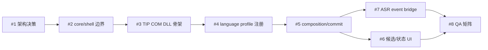

# ADR 0001: TSF TIP 最小可行架构

**状态**: Accepted  
**日期**: 2026-06-15  
**关联 issue**: [#1 调研 TSF TIP 最小可行架构和风险边界](https://github.com/Tinnci/doubao-ime-win/issues/1)

## 背景

当前项目已经有 Rust 实现的 ASR、音频采集、配置、凭据、热键、托盘、悬浮按钮和 `SendInput` 文本注入。milestone 的目标不是继续强化键盘模拟，而是把项目注册为系统级 Windows 输入法，也就是 TSF Text Input Processor (TIP)。

TSF TIP 的最小成功路径包含两件不同的事：

- Windows 能发现、注册、加载并激活 TIP。
- TIP 能通过 TSF context/edit session/composition 向目标应用更新和提交文本。

ASR 接入必须排在这两件事之后，否则网络、音频和线程问题会掩盖 TIP 本身是否可用。

## 决策

采用“Rust voice core + TSF shell”的双层架构：

- voice core 继续使用 Rust，保留现有 ASR、音频、配置、凭据和状态机能力。
- TSF shell 先用 Rust `cdylib` + `windows` crate 做最小 spike。
- 如果 Rust 直接实现 COM/TIP 接口的成本或稳定性不可接受，TSF shell 切换为 C++/Win32 DLL，Rust core 通过 C ABI 或进程内 FFI 被调用。
- `SendInput` 只保留在现有辅助工具/fallback app 中，不进入 TSF 主路径。
- ASR worker 不持有 TSF COM 指针；所有 TSF context 修改必须通过 TSF thread 上的 edit session。

## 方案比较

| 方案 | 结论 | 原因 |
|------|------|------|
| Rust core + Rust TSF `cdylib` | 推荐先 spike | 复用现有 Rust 技术栈和依赖，最快验证能否注册/加载/激活 |
| Rust core + C++ TSF shell | 保留 fallback | Windows TSF/COM 示例和调试经验更多，适合在 Rust COM 成本过高时切换 |
| 全部改成 C++ | 放弃 | ASR、异步网络、音频和配置已经在 Rust 中实现，重写成本高且没有必要 |
| 继续 `SendInput` 辅助工具 | 放弃作为主线 | 不能出现在 Windows 输入法列表，无法提供标准 composition/candidate 行为 |
| 独立进程 + IPC 到 TIP | 暂缓 | 可隔离崩溃和运行时，但第一阶段会增加 IPC、生命周期和安装复杂度 |

## 必须实现的 TSF/COM 面

### COM DLL

- `DllGetClassObject`
- `DllCanUnloadNow`
- `DllRegisterServer`
- `DllUnregisterServer`
- `IClassFactory`
- TIP CLSID 和 profile GUID 的集中定义
- 注册/卸载过程的幂等和日志

### TSF text service

- `ITfTextInputProcessorEx::ActivateEx`
- `ITfTextInputProcessor::Deactivate`
- 保存 `ITfThreadMgr` 和 client id
- 激活/停用路径日志
- 停用时清理 composition、UI 和后台 worker

### Profile 注册

- `ITfInputProcessorProfiles::Register`
- `ITfInputProcessorProfiles::AddLanguageProfile`
- `ITfInputProcessorProfiles::EnableLanguageProfile`
- 卸载时删除 language profile 并反注册 text service
- 初期语言标识以 `zh-CN` / Chinese LANGID 验证，最终 BCP-47/LANGID 策略在 #4 锁定

### Composition

composition 在 #5 实现，但 #1 的架构必须为它预留：

- TSF context 获取和失效处理
- edit session 请求
- composition start/update/commit/cancel
- 目标应用拒绝 edit session 时的错误路径

## 注册路径

开发期注册顺序：

1. 构建 `doubao_tsf_tip.dll`。
2. 以管理员或具备权限的上下文运行注册工具。
3. 调用 DLL COM 注册入口或等价 installer 逻辑，写入 CLSID/InprocServer32 等 registry。
4. 通过 `ITfInputProcessorProfiles` 注册 text service。
5. 添加并启用 language profile。
6. 在 Windows 设置和任务栏输入法列表验证可见。
7. 切换到该输入法，确认 activation/deactivation 日志。

卸载顺序反向执行：

1. 禁用 language profile。
2. 删除 language profile。
3. 反注册 text service。
4. 删除 COM registry。
5. 删除安装文件。
6. 重新打开输入法列表确认无残留。

## 风险边界

| 风险 | 决策边界 | 处理方式 |
|------|----------|----------|
| Rust COM/TIP 实现不稳定 | #3 spike 后评估 | 若 class factory 或 activation 长期卡住，切 C++ shell |
| TSF 线程模型错误 | 不允许 ASR worker 直接访问 TSF | event bridge + edit session 是唯一入口 |
| 注册残留污染系统 | 不接受不可逆注册脚本 | 注册/卸载工具必须幂等并提供诊断 |
| 签名/Defender/SmartScreen | 不阻塞 dev demo，但阻塞 release | #8 QA 中列为 release blocker |
| app-container 或高权限目标应用 | 不作为 MVP 承诺 | 先覆盖普通桌面应用，后续扩展兼容矩阵 |
| arm64 | 不作为 P0 | x64 MVP 通过后再评估 |
| ASR 协议变化 | 不阻塞 TIP shell 验证 | 先用固定文本验证 composition，再接 ASR |

## P0/P1 依赖关系

P0 必须完成 #1-#4。#5 是系统级输入法可用性的核心 P1，但在 demo 成功标准里至少要实现固定文本 composition/commit。#6/#7/#8 建立在 #5 的稳定主路径之上。

## 最小 demo 成功标准

第一个 demo 不接 ASR 也可以成立，但必须满足：

- DLL 能构建，并能通过开发期工具注册和卸载。
- Windows 输入法列表出现 Doubao Voice Input。
- 用户能切换到该输入法，并看到 TIP activation/deactivation 日志。
- 在 Notepad 中触发固定文本 composition update 和 final commit。
- 卸载后 profile、registry 和安装目录无残留。

ASR 接入 demo 的成功标准另由 #7 验收：

- interim 结果持续更新 composition。
- final 结果提交文本。
- 错误、取消、超时不会遗留 composition 或导致 TSF 死锁。

## 后续检查点

- #2 产出 core API 和事件模型草案。
- #3 用最小 DLL 验证 Rust `cdylib` 可行性。
- #4 明确最终 GUID、语言标识、图标和注册工具行为。
- #5 先用固定文本验证 TSF composition，再允许 ASR 接入。
