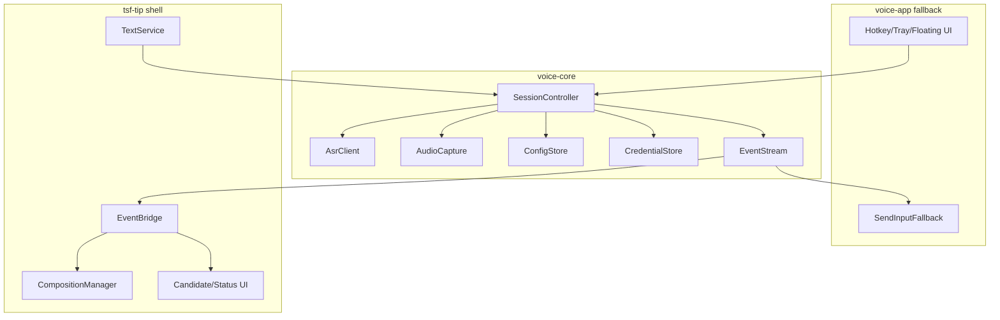

# Rust Core 与 TSF Shell 边界

**状态**: Rust event boundary implemented; C ABI deferred  
**日期**: 2026-06-15  
**关联 issue**: [#2 定义 Rust 核心与 TSF shell 的边界](https://github.com/Tinnci/doubao-ime-win/issues/2)

## 1. 目标

把当前语音输入辅助工具中的 ASR、音频、配置、凭据和会话状态整理为可被 TSF shell 调用的 voice core，同时避免 TSF/COM 细节进入 core。

边界目标：

- core 可被当前 `doubao-voice-input.exe` 和后续 `doubao_tsf_tip.dll` 共用。
- core 不依赖 `SendInput`、全局热键、托盘、悬浮按钮、TSF 或 COM。
- shell 只通过命令和事件与 core 交互。
- ASR worker 和音频 worker 不持有 TSF COM 指针。

## 2. 模块图



## 3. Crate 职责

| Crate / 模块 | 允许依赖 | 禁止依赖 |
|--------------|----------|----------|
| `voice-core` | `tokio`、ASR protocol、audio、config、credential、logging | TSF、COM、`SendInput`、hotkey、tray、window UI |
| `voice-app` | `voice-core`、hotkey、tray、floating button、`SendInputFallback` | TSF COM objects |
| `tsf-tip` | `voice-core`、Windows TSF/COM、candidate/status UI | `SendInputFallback`、global hotkey、tray app lifecycle |
| `tip-installer` | shared GUID/profile definitions、registry/profile APIs | ASR/audio session runtime |

## 4. Core API 草案

Rust 内部 API：

```rust
pub struct VoiceCore {
    // owns runtime handles, config, credentials, and session state
}

pub struct CoreConfig {
    pub config_path: Option<PathBuf>,
    pub log_dir: Option<PathBuf>,
    pub language: String,
}

pub struct SessionOptions {
    pub source: SessionSource,
    pub language: String,
    pub vad_enabled: bool,
}

pub enum SessionSource {
    FallbackApp,
    TsfTip,
    TestHarness,
}

impl VoiceCore {
    pub fn initialize(config: CoreConfig) -> Result<Self, CoreError>;
    pub fn subscribe(&self) -> VoiceEventReceiver;
    pub async fn start_session(&self, options: SessionOptions) -> Result<SessionId, CoreError>;
    pub async fn stop_session(&self, session_id: SessionId) -> Result<(), CoreError>;
    pub async fn cancel_session(&self, session_id: SessionId) -> Result<(), CoreError>;
    pub async fn shutdown(&self) -> Result<(), CoreError>;
}
```

FFI/C ABI 如果 shell 需要跨语言调用：

```c
typedef void* DoubaoCoreHandle;
typedef uint64_t DoubaoSessionId;

int doubao_core_initialize(const DoubaoCoreConfig* config, DoubaoCoreHandle* out);
int doubao_core_start_session(DoubaoCoreHandle core, const DoubaoSessionOptions* options, DoubaoSessionId* out);
int doubao_core_stop_session(DoubaoCoreHandle core, DoubaoSessionId session);
int doubao_core_cancel_session(DoubaoCoreHandle core, DoubaoSessionId session);
int doubao_core_poll_event(DoubaoCoreHandle core, DoubaoVoiceEvent* out, uint32_t timeout_ms);
void doubao_core_free_event(DoubaoVoiceEvent* event);
void doubao_core_shutdown(DoubaoCoreHandle core);
```

第一阶段可以只实现 Rust API。只有在 #3 切 C++ shell 时才需要落 C ABI。

当前代码中的第一步实现是较窄的 in-process API：

- `VoiceCore::new(asr_client, audio_capture)`
- `VoiceCore::start_session(options) -> (SessionId, VoiceEventReceiver)`
- `VoiceCore::stop_session(session_id)`
- `VoiceCore::cancel_session(session_id)`
- `VoiceCore::is_recording()`

`initialize`、独立 `subscribe` 和 `shutdown` 仍是 workspace 化后的目标 API，等 core 接管配置、凭据和 runtime 生命周期时再补齐。

## 5. 事件模型

| 事件 | 字段 | 说明 |
|------|------|------|
| `SessionStarted` | `session_id`, `source`, `started_at` | core 已开始录音和 ASR |
| `RecordingStateChanged` | `session_id`, `state` | idle/recording/stopping |
| `InterimText` | `session_id`, `revision`, `text`, `is_stable` | ASR 中间结果，TIP 映射为 composition update |
| `FinalText` | `session_id`, `revision`, `text` | ASR 最终结果，TIP 映射为 commit |
| `SessionCancelled` | `session_id`, `reason` | 用户或 shell 取消 |
| `SessionEnded` | `session_id` | session 生命周期结束 |
| `Error` | `session_id`, `kind`, `message`, `recoverable` | 错误事件，shell 决定是否显示和清理 |

事件顺序规则：

- 同一个 `session_id` 内 `revision` 单调递增。
- shell 可以丢弃旧 revision 的 interim。
- `FinalText`、`SessionCancelled`、`Error(recoverable=false)` 都要求 TIP 清理当前 composition。
- `SessionEnded` 是生命周期结束信号，不保证带文本。

## 6. 错误模型

| 错误类型 | 典型原因 | Shell 行为 |
|----------|----------|------------|
| `ConfigError` | 配置缺失、格式错误 | 显示错误状态，不启动 session |
| `CredentialError` | token 缺失、认证失败 | 结束 composition，提示重新登录/注册 |
| `AudioError` | 无麦克风、设备占用、采集失败 | 结束 session，状态 UI 显示错误 |
| `NetworkError` | 连接失败、超时、WebSocket 断开 | 清理 composition，可允许重试 |
| `ProtocolError` | ASR 响应无法解析或协议变化 | 清理 composition，记录诊断 |
| `Cancelled` | 用户取消或 TIP 停用 | 清理 composition，不显示错误 |
| `InternalError` | panic guard、未知异常 | 清理 composition，阻止 TIP thread 崩溃 |

core 只能返回业务错误；TSF edit session 失败、context 失效、profile 注册失败属于 shell 错误，不进入 core 错误模型。

## 7. 线程和生命周期规则

- `VoiceCore::start_session` 不阻塞 TSF thread；它只启动 worker 并立即返回 session id。
- 音频采集和 ASR 网络任务运行在 core 管理的 runtime 中。
- TIP shell 从 event bridge 收到事件后，只在 TSF thread 请求 edit session。
- core 不持有 `ITfThreadMgr`、`ITfContext`、`ITfComposition` 或窗口句柄。
- TIP `Deactivate` 必须调用 `cancel_session`，然后丢弃该 session 的后续事件。
- session id 是 shell 判断过期事件的唯一依据。

## 8. Fallback App 适配

当前辅助工具继续工作，但要把输入提交从 core 中移到 app adapter：

```text
VoiceCore event -> FallbackApp adapter -> SendInputFallback
```

fallback adapter 可以继续使用现有增量更新算法：

- 找最长公共前缀。
- 删除旧文本超出前缀的部分。
- 插入新文本超出前缀的部分。

该算法不得被 `tsf-tip` 使用；TIP 只能通过 composition/update/commit 表达文本变化。

## 9. 迁移步骤

1. 新增 `voice-core` API 类型和事件类型，不移动代码。
2. 把 `VoiceController` 中的 ASR result loop 抽成 session controller。
3. 让 fallback app 订阅 core events，并在 adapter 中调用 `TextInserter`。
4. 确保现有 exe 编译通过，行为不变。
5. 让 `tsf-tip` shell 复用同一套 core events。
6. 若 #3 切 C++ shell，再补 C ABI 包装。

## 10. #2 验收映射

| 验收项 | 当前落点 |
|--------|----------|
| 清晰模块图或 README 说明 | 本文档第 2 节和 [project-structure.md](./project-structure.md) |
| core API 草案 | 本文档第 4 节 |
| 初始化、开始输入、取消输入、提交文本、状态回调 | `initialize`、`start_session`、`cancel_session`、`FinalText` event、`subscribe` |
| 错误传播、日志、线程模型、生命周期 | 本文档第 6-7 节 |
| 现有 CLI/UI 路径不被破坏 | 迁移步骤要求 fallback app adapter 保持现有 `TextInserter` 路径 |
