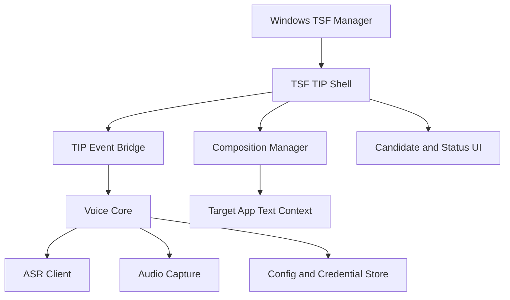
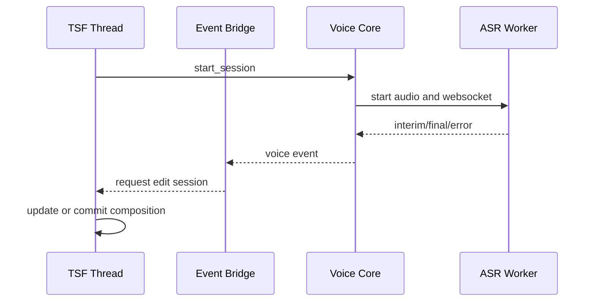

# Doubao Voice Input - TSF TIP 技术架构

**版本**: v3.0  
**日期**: 2026-06-15  
**范围**: 系统级 Windows IME / TSF Text Input Processor

## 1. 架构决策

当前推荐路线是“复用 Rust core，新增 TSF shell”：

- 保留现有 ASR、音频、配置、凭据和日志能力，整理成可复用 core API。
- 新增 TSF TIP shell，负责 COM DLL、language profile、TSF activation、composition 和候选/状态 UI。
- `SendInput` 路径保留为现有辅助工具和开发期 fallback，不再作为系统级 IME 主路径。
- TSF 对象只在 TSF 要求的线程和 edit session 中访问，ASR worker 通过事件队列与 TIP shell 通信。

第一阶段优先验证 Rust `cdylib` + `windows` crate 能否稳定承载 TIP DLL。如果 COM class factory、registry 或 TSF interface 实现成本过高，保留 Rust core API，把 shell 切到 C++/Win32 实现。

完整决策记录见 [ADR 0001: TSF TIP 最小可行架构](./adr-0001-tsf-tip-architecture.md)。Rust core 与 TSF shell 的接口合约见 [Rust Core 与 TSF Shell 边界](./core-shell-boundary.md)。

## 2. 目标分层

| 层 | 职责 |
|----|------|
| TSF TIP Shell | COM DLL 导出、class factory、TIP lifecycle、profile 注册、thread manager/context 接入 |
| TIP Event Bridge | 把 core 的识别状态事件排队，转换成 TSF edit session 请求 |
| Voice Core | ASR session、音频采集、配置、凭据、状态机、错误建模 |
| Composition Manager | composition start/update/commit/cancel，管理当前 TSF context 和 edit cookie |
| Candidate/Status UI | 候选窗、录音状态、错误提示、光标定位、DPI/多显示器适配 |
| Fallback App | 现有热键/托盘/悬浮按钮和 `SendInput` 输入路径 |

## 3. 进程和产物

| 产物 | 类型 | 说明 |
|------|------|------|
| `doubao-voice-input.exe` | bin | 当前辅助工具，可继续用于 ASR/fallback 验证 |
| `doubao_voice_core` | Rust lib | 目标 core 边界，供 exe 和 TIP shell 共用 |
| `doubao_tsf_tip.dll` | `cdylib` 或 C++ DLL | 系统级 TIP shell，导出 COM DLL 入口 |
| `doubao-tip-installer.exe` / scripts | tool | 开发期注册、卸载、profile 管理和诊断 |

## 4. Core API 边界

Voice core 不应依赖 TSF、COM、窗口句柄或输入法 UI。它只暴露输入控制和事件流。

| API | 说明 |
|-----|------|
| `initialize(config_path)` | 加载配置、凭据、日志和运行时资源 |
| `start_session(options)` | 开始录音和 ASR session |
| `stop_session()` | 停止录音并请求 final/结束事件 |
| `cancel_session()` | 取消录音并释放音频/网络资源 |
| `subscribe_events()` | 输出 `RecordingStarted`、`InterimText`、`FinalText`、`Error`、`SessionEnded` 等事件 |
| `shutdown()` | 释放运行时和后台任务 |

事件模型：

| 事件 | TIP 行为 |
|------|----------|
| `RecordingStarted` | 更新状态 UI，必要时准备 composition |
| `InterimText(text)` | 排队 TSF edit session，更新 composition |
| `FinalText(text)` | 排队 TSF edit session，提交文本并结束 composition |
| `Cancelled` | 清理 composition 和 UI |
| `Error(kind, message)` | 清理 composition，显示错误状态，不阻塞 TSF 线程 |
| `SessionEnded` | 释放 session 状态，隐藏 UI |

## 5. TSF TIP Shell

### 5.1 COM DLL 入口

P0 需要实现：

- `DllGetClassObject`
- `DllCanUnloadNow`
- `DllRegisterServer`
- `DllUnregisterServer`
- COM class factory
- TIP CLSID、profile GUID、description、icon path 的集中定义

开发期注册可以先使用脚本或 installer tool 调用 DLL 注册入口；发布期再进入签名安装包。

### 5.2 TIP 生命周期

最小接口：

- `ITfTextInputProcessorEx::ActivateEx`
- `ITfTextInputProcessor::Deactivate`

激活时：

1. 保存 `ITfThreadMgr` 和 client id。
2. 初始化 TIP thread-local 状态。
3. 订阅需要的 TSF sinks。
4. 准备 core event bridge。
5. 写入可诊断日志。

停用时：

1. 取消未完成的 ASR session。
2. 清理 composition。
3. 隐藏候选/状态 UI。
4. 解除 sinks。
5. 释放 thread manager/context 引用。

## 6. Language Profile 注册

使用 `ITfInputProcessorProfiles` 完成：

- 注册 text service CLSID。
- 注册 language profile GUID。
- 设置语言标识、描述、图标和启用状态。
- 验证 Windows 设置页和任务栏输入指示器可见。
- 卸载时反向清理 profile 和 registry。

语言标识初期以 `zh-CN` / `LANG_CHINESE` 路线验证；BCP-47 与旧式 LANGID 的最终策略需要在 #4 中锁定。

## 7. Composition 模型

TSF composition 是系统级输入法主路径。

| ASR 状态 | Composition 行为 |
|----------|------------------|
| session start | 如果当前 context 可编辑，准备 composition |
| interim | 在 edit session 中更新组合文本 |
| final | 在 edit session 中提交最终文本并结束 composition |
| cancel | 清理 composition，不提交文本 |
| error | 清理 composition，显示错误状态 |

约束：

- ASR worker 不直接访问 TSF context。
- 所有上下文修改通过 TSF edit session 完成。
- 必须处理目标应用拒绝 edit session、焦点变化、context 失效和 composition 已被外部结束的情况。
- 不能继续依赖退格/重输来模拟组合态；旧增量更新算法只保留在 fallback app 内。

## 8. 线程和异步模型

核心原则：

- TSF thread 只做短任务，不等待网络或音频。
- ASR worker 只发事件，不持有 TSF COM 指针。
- Event bridge 负责背压和去重，避免 interim 结果过快导致 edit session 堆积。
- 停用 TIP 时必须能取消 worker，并丢弃已过期事件。

## 9. Candidate 和状态 UI

第一阶段 UI 可以很薄，但必须遵守系统输入法窗口行为：

- 跟随 TSF layout/caret rectangle 定位。
- 失焦、停用、取消、错误时隐藏。
- 支持 DPI 缩放和多显示器坐标转换。
- 不遮挡当前输入文本。
- 至少显示录音、识别中、提交中、错误状态。

完整候选选择、暗色模式和样式优化放到 composition 主路径稳定之后。

## 10. 安装和卸载

开发期需要：

- 注册/卸载 COM DLL。
- 注册/卸载 TSF language profile。
- 输出注册状态诊断。
- 支持重复运行和失败回滚。

发布期需要：

- 代码签名。
- 安装包或管理员模式安装流程。
- 升级保留配置和凭据。
- 卸载后清理 profile、registry、文件和快捷入口。

## 11. 现有代码迁移

| 当前模块 | 迁移策略 |
|----------|----------|
| `src/asr` | 保留，整理为 voice core 的 ASR 子模块 |
| `src/audio` | 保留，作为 core 的音频采集子模块 |
| `src/data` | 保留，补充 TIP 可用的配置路径和凭据加载方式 |
| `src/voice_core` | 已抽出 ASR/audio session 事件边界，后续迁入 `crates/voice-core` |
| `src/business/voice_controller.rs` | 已改为 fallback adapter，订阅 core events 后调用 `TextInserter` |
| `src/business/text_inserter.rs` | 保留在 fallback app，不能被 TSF 主路径依赖 |
| `src/ui` | 当前托盘/悬浮按钮保留给 fallback app；TIP UI 独立实现 |

## 12. 风险和验证

| 风险 | 影响 | 处理 |
|------|------|------|
| Rust 直接实现 COM/TIP 成本高 | 延误 #3/#4 | 先 spike 最小 DLL；必要时切 C++ shell |
| TSF edit session 线程模型错误 | 死锁或目标应用崩溃 | 强制事件队列隔离，所有 TSF 修改进 edit session |
| profile 注册残留 | 污染系统输入法列表 | 注册/卸载工具必须幂等，并提供诊断输出 |
| ASR interim 频率过高 | UI 抖动或 edit session 堆积 | bridge 做节流、合并和过期事件丢弃 |
| 签名/Defender/SmartScreen | 发布受阻 | QA 矩阵中提前列为 release blocker |

## 13. 最小实现切片

1. 写架构决策和 core API 草案。
2. 建立 `doubao_tsf_tip.dll` 最小 COM DLL，能注册和被 TSF manager 加载。
3. 注册 language profile，能在 Windows 输入法列表显示并触发 activation。
4. 在无 ASR 的情况下，用固定文本验证 composition update 和 commit。
5. 接入 ASR event bridge，把 interim/final 映射到 composition/commit。
6. 增加状态 UI、候选窗定位和 QA 矩阵。
